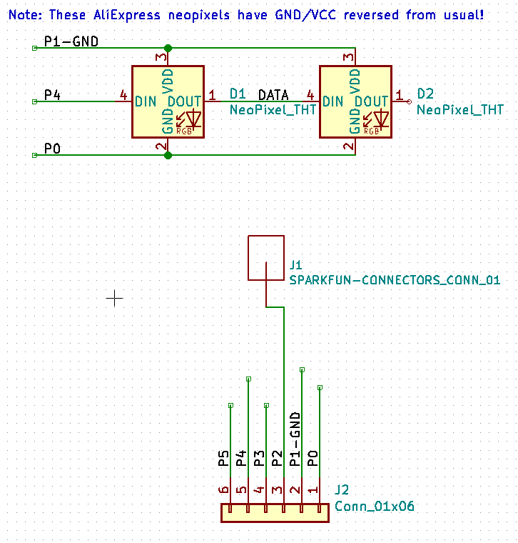
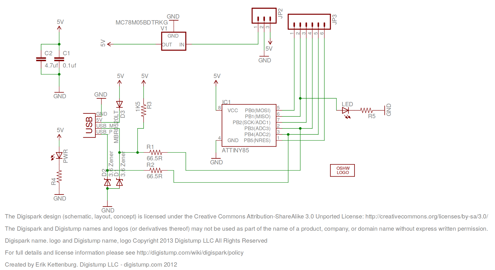
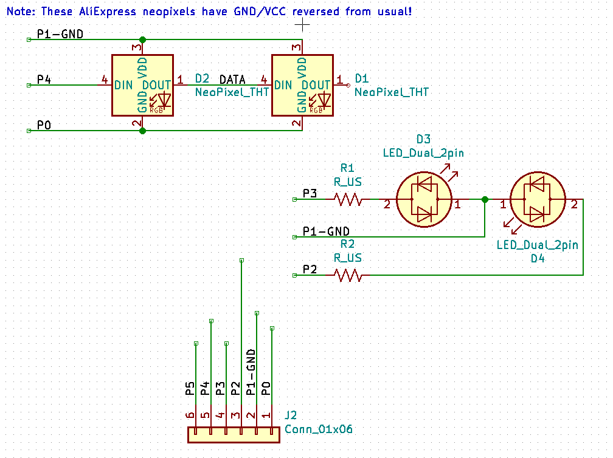

Soldering Turkey Kits
=====================

[Brookline Public Schools](https://twitter.com/BrooklinePublic) are having
their first Maker Day on May 11, 2019.

I volunteered to run a "learn to solder" station, and decided to
design some simple PCBs.  There was already a "make a badge with a
blinking LED" station, so I needed to be a *little* more ambitious...
but I wanted to bring the project to cost ~$2/board so we could afford
to make 200 of them for the kids.

The idea we came up with was to use the really-cheap
[Digispark](http://digistump.com/products/1) boards
([@$1 each from aliexpress](https://www.aliexpress.com/item/Free-shipping-100pcs-Digispark-kickstarter-development-board-ATTINY85-module-for-Arduino-usb/32695637478.html)) as the basis -- that provides power (via
USB and on-board regulator) and basic connectivity, and suggests
further take-home activities for the kids and their parents after the
event, based on the beloved-by-education Arduino environment.  The
fantastic turkey art was contributed by Caroline Barnes of
[brooklineturkeys.com](https://brooklineturkeys.com) /
[@BklineTurkeys](https://twitter.com/BklineTurkeys).

A [9V battery](https://amzn.com/B07FX6F192)
and [snap](https://amzn.com/B01AJ5ETBQ)
can be soldered into the Vin/GND pads on the digispark.

For output: two
[NeoPixel LEDs](https://www.aliexpress.com/item/WS2811-5mm-F5-8mm-F8-DC5V-Diffused-Round-hat-RGB-LED-pixels-2811-Arduino-led-chips/32972750131.html),
in beginning-solderer-friendly through-hole
packages.  I've got two basic designs here, and I haven't quite
decided which to use in the event.  In the "staring turkey", the
circuit is *just* the two neopixels.  Conveniently, we don't need
current-limiting resistors, and we "cheat" and save the trouble of
soldering a separate header for power by using two GPIO pin for +5V
and GND.  A separate GPIO is connected to the turkey's beak, which
should (fingers crossed) provide a simple touch sensitive input.  We
can imagine fun easter eggs, like allowing you to tap morse code into
the beak and having the turkeys eyes flash back a morse code message
(see my [Ben Bitdiddle puzzle](http://www.mit.edu/~puzzle/2012/puzzles/ben_bitdiddle/investigators_report/solution/)
for an example of this UX).

The second board is a bit more ambitious: in addition to two
neopixels, this time used to backlight the body of the turkey, we have
two "conventional" LEDs for the eye and tip of the soldering iron (and
the required series resistors for these).  This time the wing of the
turkey is the touch sensitive area.  I'll have a
[pile of conventional LEDs in different colors](https://www.aliexpress.com/item/20pcs-x-5-Colors-100pcs-3mm-2pins-Flat-top-White-Red-Yellow-Blue-Green-Wide-Angle/1954971920.html)
so that kids can choose which colors to use
(and a few
[flashing RGB two-terminal devices](https://www.sparkfun.com/products/11449)).
This is a more
incremental learning experience for the kids: once they've soldered
the bare minumum (the digispark header on the board) they've got a
choice of four things to do next: battery snap (let's them run w/o a
USB tether), the eye LED + resistor, the soldering iron LED +
resistor, or one or two neopixels.  They can stop at any point and
walk away with something that works.  We can distribute handouts with
links to the software for the project, the design files, and full
assembly instructions (including where to buy a cheap soldering iron
on amazon), so they can continue to finish the project at home --
spreading maker culture, which is the real point of the day!

I just ordered the [PCBs from pcbway in quantity 200](https://www.pcbway.com/project/sponsor/Learn_to_Solder_kit__PCB_turkey_.html).
Fingers crossed they all work correctly when I get them back!

I still haven't decided which design to use on Maker Day, but if I screwed up
one of the boards my decision will be easy. ;)

-- C. Scott Ananian, Apr 8, 2019

Useful Resources
================

Here's the [Digispark Schematic](./DigisparkSchematic.pdf) and here's
the [DigiSpark wiki](http://digistump.com/wiki/digispark)
with lots of software and getting-started information.

The
[SAO tutorial video](https://hackaday.io/page/5405-my-def-con-26-talk-notes) and
[PCB color guide](https://docs.google.com/spreadsheets/d/1dmkTsKZDV5iltQbpEa_QOL5XYEONms_M1ZETBNO5ub4/edit) by
[TwinkleTwinkie](https://hackaday.io/twinkletwinkie) have been great
helps!

Brian Benchoff's [KiCad tutorial series](https://hackaday.com/2016/11/17/creating-a-pcb-in-everything-kicad-part-1/) taught me how to use [KiCad](http://kicad-pcb.org/), and his article on [BOM cost optimization](https://hackaday.com/2017/10/06/bom-cost-optimization-and-tindie-badge-engineering/) had a few useful pointers for this project as well.

Uri Shaked's [article on PCB art](https://medium.com/@urish/a-practical-guide-to-designing-pcb-art-b5aa22926a5c) helped me explain this whole
[#badgelife](https://twitter.com/search?q=%23badgelife) thing to others.

Shea Silverman's [PCBArt article](http://blog.sheasilverman.com/2019/01/pcbart/) walked me through using the [Inkscape](https://inkscape.org/) [svg2shenzhen extension](https://github.com/badgeek/svg2shenzhen).
